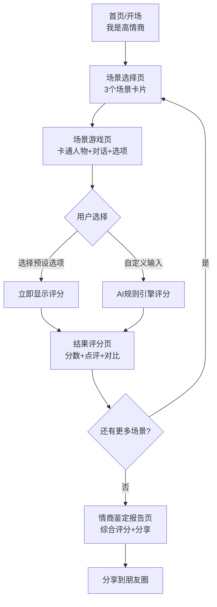

# 产品需求文档 (PRD) - 我是高情商

## 1. 产品概述

一款以搞笑社交场景为核心的H5互动小游戏，用户在模拟的"年夜饭催婚"、"职场送命题"、"酒局被迫营业"等真实尴尬场景中，选择或自创回应方式，系统实时给出情商评分和爆笑点评，最终生成个人"情商鉴定报告"供社交分享。

**产品定位：**
- 产品类型：轻量级H5互动游戏
- 核心玩法：场景选择 + 自由输入 + AI评分
- 目标用户：18-35岁年轻互联网用户
- 使用场景：朋友圈/微信群传播、茶余饭后娱乐、节假日社交话题
- 情绪价值：搞笑解压、社交谈资、自我认知

## 2. 核心功能

### 2.1 功能亮点

| 功能 | 说明 |
|------|------|
| 🎭 3个经典场景 | 年夜饭催婚、职场加班、酒局敬酒 |
| 🎯 4级情商选项 | 低/中/高/神 四档预设回复 |
| 🎤 语音输入 | 支持Web Speech API语音识别 |
| ✍️ 自定义回复 | 用户输入自由发挥，系统智能评分 |
| 📊 评分系统 | 每场景独立评分 + 最终综合报告 |
| 🎨 卡通风格 | Emoji角色 + 动画效果 + 渐变配色 |
| 📱 移动适配 | 完全响应式，适合手机端分享 |

### 2.2 页面结构

| 页面 | 核心元素 |
|------|----------|
| 首页 | 大标题 + 副标题 + 开始按钮 + 浮动Emoji |
| 场景选择 | 3张场景卡片，带图标和描述 |
| 场景游戏 | 卡通人物区 + 对话气泡 + 选项按钮 + 自定义输入框 |
| 结果页 | 大分数 + 等级徽章 + 搞笑点评 + 高低情商对比 |
| 总结报告 | 综合分数 + 段位称号 + 各场景进度条 + 分享按钮 |

## 3. 核心场景设计

### 场景一：🧨 年夜饭·七大姑八大姨

**场景描述：** 过年回家，年夜饭桌上坐满了亲戚。大姑端着酒杯笑眯眯地走过来，开始了经典的"灵魂拷问"——催婚。

**卡通人物：** 奶奶👵、大姑👩、二叔🧓、表姐👱‍♀️（已婚已育，是"别人家的孩子"）

**触发对话：**
> "小X啊，你看你表姐都生二胎了，你咋还不找对象呢？来来来，大姑敬你一杯，祝你明年脱单！赶紧把这杯喝了！"

**预设回应选项：**

| 等级 | 回应内容 | 分数 |
|------|----------|------|
| 💀 低情商 | "大姑，我的事不用你管，我又不是找不到。" | 20分 |
| 😅 中情商 | "哈哈大姑，缘分还没到嘛，不着急~" | 55分 |
| 😎 高情商 | "大姑！这杯我干了！但我得先找个像姑父这么优秀的，您帮我参谋参谋？" | 80分 |
| 👑 情商之神 | "大姑这杯酒我必须喝！您这是把我当自己孩子疼！不过我现在单身，年终奖全给您买保健品，脱单了可就没这待遇了哈！" | 95分 |

**高情商核心技巧：** 夸对方 + 幽默自嘲 + 巧妙转移话题

---

### 场景二：💼 职场·老板的送命题

**场景描述：** 周五下午6点，你正准备收拾东西下班。老板突然走到你工位旁边，笑着说了一句"不着急"的话——但你知道，这绝对着急。

**卡通人物：** 王总🤵（笑里藏刀型领导）、李经理👨‍💼（旁边看戏）、你👩‍💻

**触发对话：**
> "小X啊，这个方案周一要用，你看看周末能不能加个班赶一下？放心，不着急，你看着安排就行。"

**预设回应选项：**

| 等级 | 回应内容 | 分数 |
|------|----------|------|
| 💀 低情商 | "周末我有事，而且这也不是一个周末能搞完的。" | 15分 |
| 😅 中情商 | "好的王总，我尽量周末赶出来。" | 50分 |
| 😎 高情商 | "王总，我周末可以搞！不过有几个关键点想跟您确认下，免得周一还得改，您看明天方便打个电话吗？" | 82分 |
| 👑 情商之神 | "王总您放心！不过这方案要让客户眼前一亮，我可能需要李经理那边的数据支持，您看能不能帮我协调一下？咱争取一稿过！" | 96分 |

**高情商核心技巧：** 态度积极 + 确认需求（避免无效加班） + 争取资源 + 展示主动性

---

### 场景三：🍻 酒局·被迫营业

**场景描述：** 公司商务宴请，客户刘总喝得兴起，端着满杯白酒向你走来。你的领导张哥在旁边疯狂使眼色——这杯酒，关系到一个大项目。

**卡通人物：** 张哥🧔（你的直属领导，紧张脸）、客户刘总👨（豪爽型）、你🙋

**触发对话：**
> "小X！我听说你们年轻人都能喝！来，咱俩走一个！这杯喝了，后面那个项目的事儿好说！"

**预设回应选项：**

| 等级 | 回应内容 | 分数 |
|------|----------|------|
| 💀 低情商 | "刘总不好意思，我不能喝酒，医生不让。" | 25分 |
| 😅 中情商 | "刘总我干了您随意！项目的事您放心！" | 50分 |
| 😎 高情商 | "刘总！跟您喝酒是福气！这杯我先干为敬！不过项目的事儿，就算不喝酒我也得给您办漂亮了，谁让您是我最重视的客户呢！" | 85分 |
| 👑 情商之神 | "刘总！这杯必须喝！但我得跟您说实话——我酒量不行，喝多了怕耽误给您干活。这样，我先干三杯表诚意，剩下的让我用项目质量来还，您看行不？" | 98分 |

**高情商核心技巧：** 给面子 + 表诚意 + 设边界 + 把"喝酒"转化为"工作承诺"

## 4. 自定义输入与评分系统

### 4.1 评分维度

| 维度 | 权重 | 说明 |
|------|------|------|
| 情绪价值 | 30% | 是否让对方感到被尊重、被重视 |
| 幽默感 | 25% | 是否有笑点、能化解尴尬 |
| 话题转移 | 20% | 是否巧妙避开雷区、转移焦点 |
| 边界感 | 15% | 是否在不得罪人的前提下守住底线 |
| 表达流畅度 | 10% | 语句是否通顺、有逻辑 |

### 4.2 自定义输入评分规则（前端规则引擎）

**基础分：** 50分

**加分项：**
- 包含礼貌用词（您、谢谢、感谢）：+5/词
- 包含幽默元素（哈哈、笑、段子）：+3/词
- 包含转折技巧（不过、但是、这样）：+4/词
- 回复长度适中（15-80字）：+10
- 包含夸赞对方的内容：+8

**减分项：**
- 包含攻击性词汇（滚、烦、关你啥事）：-15/词
- 回复过短（<5字）：-10
- 纯拒绝无缓冲：-10

**分数范围：** 10-99分

### 4.3 段位体系

| 分数区间 | 段位 | 图标 | 描述 |
|----------|------|------|------|
| 90-100 | 情商之神 | 👑 | 社交天花板，行走的人际关系教科书 |
| 70-89 | 情商达人 | 😎 | 八面玲珑，大多数场合游刃有余 |
| 40-69 | 及格选手 | 😅 | 不功不过，偶尔踩雷 |
| 0-39 | 社交杀手 | 💀 | 建议闭关修炼，先从微笑开始 |

## 5. 用户旅程

```
开场动画 → 选择场景 → 进入场景（看到卡通人物+对话）
→ 选择/输入回应 → 查看评分+爆笑点评 → 下一场景
→ 生成情商报告 → 分享
```

**流程图：**



## 6. 视觉设计方案

### 6.1 整体风格

| 要素 | 方案 |
|------|------|
| 风格 | 轻松搞笑、年轻潮流、微信社交感 |
| 配色 | 主色渐变紫（#667eea → #764ba2），强调色粉红（#f5576c） |
| 人物 | Emoji卡通风格，简洁可爱，降低制作成本 |
| 动效 | 浮动动画、弹入动画、按钮脉冲，增强趣味感 |
| 字体 | 系统默认字体，保证加载速度 |

### 6.2 动效设计

- **页面切换：** fadeIn + translateY（从下往上淡入）
- **人物角色：** float（上下浮动，错开节奏）
- **开始按钮：** pulse（呼吸脉冲，吸引点击）
- **结果卡片：** bounceIn（弹性弹入）
- **录音状态：** 红点闪烁 + 按钮脉冲
- **分数展示：** 数字滚动递增

### 6.3 响应式设计

- 移动优先设计
- 触摸优化
- 微信浏览器兼容性
- 竖屏全屏体验

## 7. 技术要求

### 7.1 性能指标

| 指标 | 目标 |
|------|------|
| 首屏加载 | < 1.5秒 |
| 页面切换 | < 300ms |
| 语音识别响应 | < 2秒 |
| 整体包大小 | < 200KB（不含图片） |

### 7.2 兼容性

- 适配微信内置浏览器
- 支持iOS Safari/Android Chrome
- 语音识别降级为纯文字输入

## 8. 分享设计

### 8.1 分享触发点

| 触发时机 | 分享内容 | 分享动机 |
|----------|----------|----------|
| 单场景结束 | "我在年夜饭场景拿了95分！" | 炫耀高分 |
| 全部完成 | 情商鉴定报告海报 | 社交货币、引发讨论 |
| 获得"情商之神" | 特殊成就徽章 | 稀缺感、荣誉感 |
| 获得"社交杀手" | 搞笑自嘲海报 | 反向传播、自黑幽默 |

### 8.2 分享海报要素

- 标题：🧠 我是高情商
- 综合评分：XX分
- 段位称号 + 图标
- 各场景得分小卡片
- 激励文案："击败了XX%的用户"
- 二维码/扫码入口

## 9. 后续迭代规划

### V2.0 场景扩展库

| 场景 | 描述 |
|------|------|
| 💑 相亲现场 | 对方问"你有房有车吗？" |
| 🎓 同学聚会 | 混得好的同学问"你现在做什么工作？" |
| 👶 带娃社交 | 别人夸"你家孩子真聪明"怎么接 |
| 🏠 邻居寒暄 | 电梯里遇到不熟的邻居 |
| 💇 Tony老师 | "你上次在哪剪的？要不要换个发型？" |

### 功能迭代路线图

| 版本 | 功能 |
|------|------|
| V2.0 | 更多场景 + AI深度评分 + 排行榜 |
| V2.5 | 多人PK模式（好友同场景对比） |
| V3.0 | 用户自建场景UGC + 社区投票 |
| V3.5 | AI语音对话模式（模拟真实对话） |
