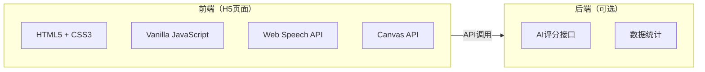

# 技术架构文档 - 我是高情商 H5 互动游戏

## 1. 技术架构设计

### 1.1 整体架构



### 1.2 技术选型

| 模块 | 技术方案 | 说明 |
|------|----------|------|
| 页面框架 | 纯HTML5 + CSS3 + JS | 轻量无依赖，加载快 |
| 语音识别 | Web Speech API | 浏览器原生支持，免费 |
| AI评分（基础版） | 前端关键词匹配算法 | 无需后端，即时响应 |
| AI评分（进阶版） | 接入LLM API | 更精准、更有趣的评分和点评 |
| 分享海报 | HTML2Canvas / 原生Canvas | 生成图片供截图分享 |
| 部署 | 静态托管（CDN） | 高并发、低成本 |

## 2. 页面路由设计

由于是单页应用（SPA），使用状态管理实现页面切换：

| 页面状态 | 描述 | URL Hash |
|----------|------|----------|
| home | 首页/开场 | #home |
| select | 场景选择 | #select |
| game | 场景游戏 | #game/{sceneId} |
| result | 结果评分 | #result/{sceneId} |
| report | 情商报告 | #report |

## 3. 数据模型

### 3.1 场景数据

```typescript
interface Scene {
  id: string;
  title: string;
  emoji: string;
  description: string;
  characters: Character[];
  triggerDialog: string;
  options: Option[];
}

interface Character {
  name: string;
  emoji: string;
  description: string;
}

interface Option {
  id: string;
  level: 'low' | 'medium' | 'high' | 'god';
  content: string;
  score: number;
}
```

### 3.2 用户进度

```typescript
interface UserProgress {
  currentScene: number;
  scores: {
    [sceneId: string]: number;
  };
  selectedOptions: {
    [sceneId: string]: string;
  };
  customInputs: {
    [sceneId: string]: string;
  };
}
```

### 3.3 评分结果

```typescript
interface ScoringResult {
  totalScore: number;
  averageScore: number;
  level: 'god' | 'master' | 'pass' | 'killer';
  levelName: string;
  comment: string;
  tips: string;
}
```

## 4. 核心功能模块

### 4.1 场景管理器 (SceneManager)

- 加载场景数据
- 管理场景切换
- 追踪用户进度

### 4.2 评分引擎 (ScoringEngine)

- 预设选项评分（固定分数）
- 自定义输入评分（规则引擎）
- 段位计算

```typescript
class ScoringEngine {
  // 预设选项评分
  scorePresetOption(optionId: string): number;

  // 自定义输入评分
  scoreCustomInput(input: string, sceneContext: Scene): number;

  // 计算段位
  calculateLevel(score: number): LevelResult;

  // 生成点评
  generateComment(score: number, level: string): string;
}
```

### 4.3 语音识别模块 (SpeechRecognizer)

- 初始化Web Speech API
- 实时语音转文字
- 降级处理（不支持时提示）

```typescript
class SpeechRecognizer {
  private recognition: SpeechRecognition | null;

  // 检查浏览器支持
  isSupported(): boolean;

  // 开始录音
  start(callback: (text: string) => void): void;

  // 停止录音
  stop(): void;
}
```

### 4.4 动画控制器 (AnimationController)

- 页面切换动画
- 人物浮动动画
- 分数滚动动画
- 按钮脉冲动画

## 5. 评分算法详解

### 5.1 自定义输入评分规则

```typescript
function scoreCustomInput(input: string): number {
  let score = 50; // 基础分

  // 加分项
  const politeWords = ['您', '谢谢', '感谢', '劳驾'];
  const humorWords = ['哈哈', '笑', '段子', '逗'];
  const transitionWords = ['不过', '但是', '这样', '虽然'];

  politeWords.forEach(word => {
    if (input.includes(word)) score += 5;
  });

  humorWords.forEach(word => {
    if (input.includes(word)) score += 3;
  });

  transitionWords.forEach(word => {
    if (input.includes(word)) score += 4;
  });

  // 长度适中加分
  const length = input.length;
  if (length >= 15 && length <= 80) score += 10;

  // 夸赞对方
  if (hasCompliment(input)) score += 8;

  // 减分项
  const aggressiveWords = ['滚', '烦', '关你啥事', '管不着'];
  aggressiveWords.forEach(word => {
    if (input.includes(word)) score -= 15;
  });

  // 回复过短
  if (length < 5) score -= 10;

  // 纯拒绝无缓冲
  if (isPureRejection(input)) score -= 10;

  // 边界限制
  return Math.max(10, Math.min(99, score));
}
```

## 6. 响应式断点

```css
/* 移动端优先 */
@media (min-width: 375px) { /* iPhone SE */ }
@media (min-width: 768px) { /* iPad */ }
@media (min-width: 1024px) { /* 桌面端 */ }
```

## 7. 浏览器兼容策略

### 7.1 语音识别降级

```typescript
if (!('webkitSpeechRecognition' in window) &&
    !('SpeechRecognition' in window)) {
  // 隐藏语音按钮，显示纯文字输入
  showTextInputOnly();
  showToast('当前浏览器不支持语音识别，请使用文字输入');
}
```

### 7.2 动画降级

```css
@media (prefers-reduced-motion: reduce) {
  *, *::before, *::after {
    animation-duration: 0.01ms !important;
    transition-duration: 0.01ms !important;
  }
}
```

## 8. 性能优化策略

1. **CSS动画优先**：使用transform和opacity实现动画
2. **懒加载场景**：按需加载场景数据
3. **减少重排重绘**：批量DOM操作
4. **使用requestAnimationFrame**：平滑动画
5. **压缩资源**：图片使用WebP格式

## 9. 部署架构

```
用户请求 → CDN → 静态资源（H5页面）
                    ↓
              微信内置浏览器 / 手机浏览器
```

**CDN推荐：** 阿里云OSS、腾讯云COS、Netlify、Vercel

## 10. 文件结构

```
/workspace
├── index.html          # 主页面
├── css/
│   └── style.css       # 样式文件
├── js/
│   ├── app.js         # 主应用逻辑
│   ├── scenes.js      # 场景数据
│   ├── scoring.js     # 评分引擎
│   └── speech.js      # 语音识别
├── assets/
│   └── (可选图片资源)
└── README.md
```
